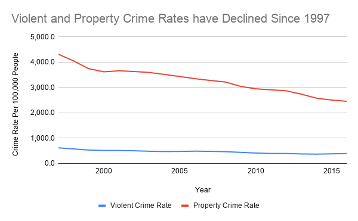
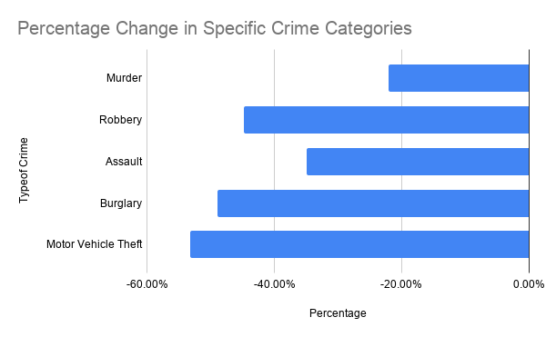

# How have crime trends in the US changed from 1997 to 2016?
Crime is often at the focus of media and public's attention. Headlines about crime can give the impression that the number is always rising. However, do long-term data support this thought?
This article uses FBI crime data in the US  between 1997 and 2016 to examine the trend of crime over time. This analysis on violent crime and property crime aims to understand which catagories of crime rises or remain stable.
## Background
The dataset was obtained from the FBI's Crime Data Explorer, which is based on the Uniform Crime Reporting (UCR) Program. The data was collected frmo orver 19,000 federal, state, county, tribal, university and college law enforcement agencies. This dataset covered national-level violent crime and property crime data from 1997 to 2016. Specific categories such as murder, robbery and burglary and includied.
The dataset is generally reliable becuase it comes from the federal government agency FBI. This dataset is widely used by the public.
However, it also has some limitations. This dataset only includes crimes that were reported to the law enforcement agencies. Many crimes go unreported, which means that the this dataset is not a complete picture of the crime in the US. In addition, this dataset doesnot show regional differences as it only includes national-level statistics. 
The dataset should also be verified by comparing with additional sources such as state crime reports. Also, it should be noticd that across the 20 years, the crime reporting methods changed.
## Analysis Process
### Data Cleaning
The data in uploaded into Google Sheets and examined for missing values and formatting issues. Then, the formats of each type of data were checked to make sure the data analysis processes correctly. This data analysis is focused on the crime rates. 
### Pivot Tables
To compare the changes in major crime categories from 1997 to 2016, pivot tables were made. Year was used as row and multiple crime rates are used as variables. 
### Data Visualization
**Chart 1** is a line chart showing the rates of violent crime and property crime. It shows the overall decline in crime.
**Chart 2** is a bar chart showing the change in percentage of five specific crime categories: murder, robbery, assault, burglary, and motor vehicle theft. To compare the percentage of change, a summary table was made using the formula *(rate 2016 - rate 1997) / rate 1997*.

## Findings
### Finding 1: Both crime types shows decline
Chart 1 shows a downward trend in both violent and property crime rates between 1997 and 2016. Property crime rate decreased from around four thousands to two thousands, while violent crime decreased from around six hundred to 4 hundred. This suggested that crime has became less common overall from 1997 to 2016.
### Finding 2: Property crime dropped more than violent crime
Although both types decreased, property crime delined larger. 
